# booru-viewer

Local desktop app for browsing, searching, and saving images from booru-style imageboards.

Qt6 GUI, cross-platform (Linux + Windows), fully themeable.

## Screenshots

**Windows 11 — Light Theme**

<picture>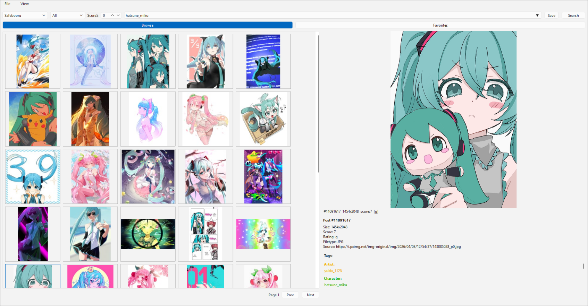</picture>

**Windows 11 — Dark Theme (auto-detected)**

<picture>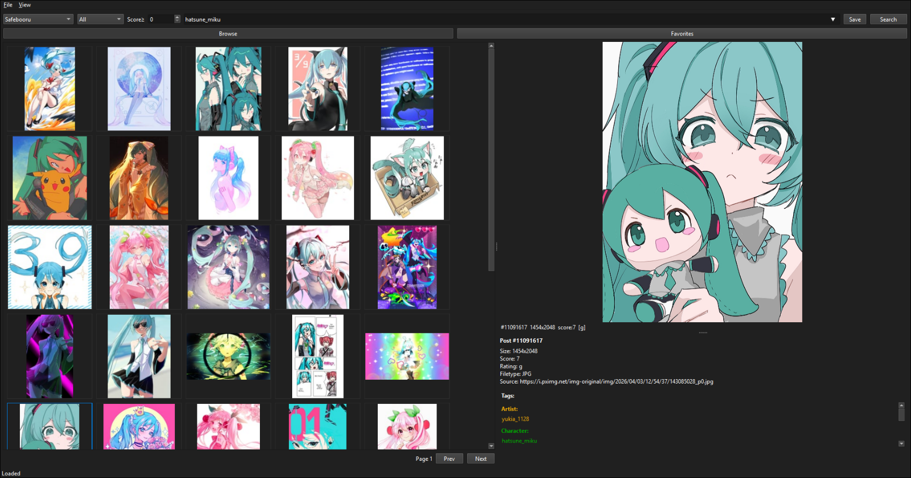</picture>

**Windows 10 — Light Theme**

<picture>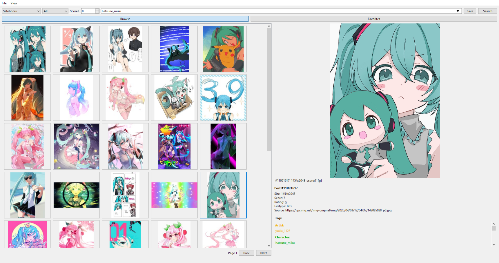</picture>

**Windows 10 — Dark Theme (auto-detected)**

<picture>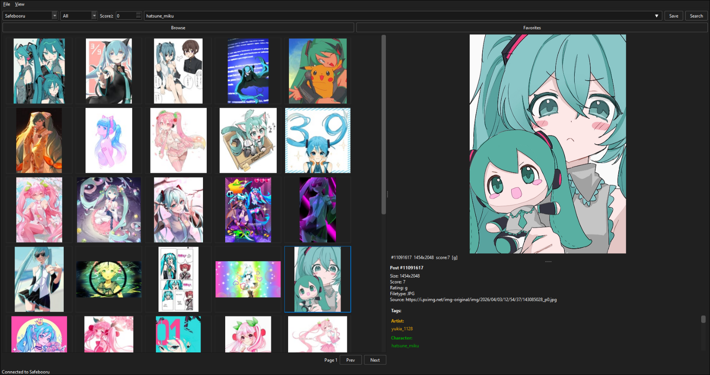</picture>

**Linux — Styled via system Qt6 theme**

<picture>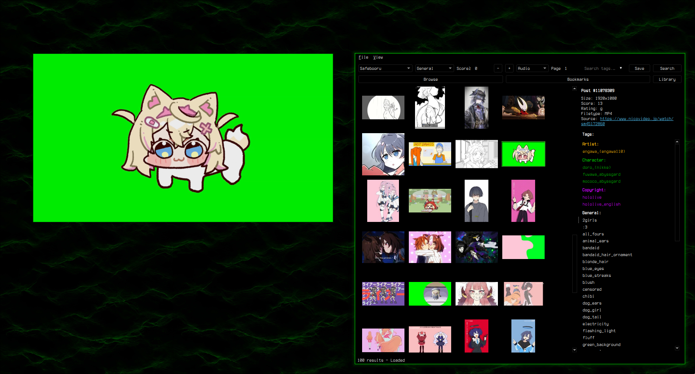</picture>

Supports custom styling via `custom.qss` — see [Theming](#theming).

## Features

### Browsing
- Supports **Danbooru, Gelbooru, Moebooru, and e621**
- Auto-detect site API type — just paste the URL
- Tag search with autocomplete, history dropdown, and saved searches
- Rating and score filtering (server-side `score:>=N`)
- Blacklisted tags (appended as negatives)
- Thumbnail grid with keyboard navigation

### Preview
- Image viewer with zoom (scroll wheel), pan (drag), and reset (middle click)
- GIF animation, Pixiv ugoira auto-conversion (zip to animated GIF)
- Video playback (MP4, WebM) with play/pause, seek, volume, mute, and seamless looping
- Info panel with post details, clickable tags, and filetype

### Slideshow Mode
- Right-click preview → "Slideshow Mode" for fullscreen viewing
- Arrow keys / `h`/`j`/`k`/`l` navigate posts (including during video playback)
- `,` / `.` seek 5 seconds in videos, `Space` toggles play/pause
- Toolbar with Bookmark and Save/Unsave toggle buttons showing current state
- `F11` toggles fullscreen/windowed, `Ctrl+H` hides all UI
- Bidirectional sync — clicking posts in the main grid updates the slideshow
- Page boundary navigation — past the last/first post loads next/prev page

### Bookmarks & Library
- Bookmark posts, organize into folders
- Three-tab layout: Browse, Bookmarks, and Library
- Save to library (unsorted or per-folder), drag-and-drop thumbnails as files
- Multi-select (Ctrl/Shift+Click, Ctrl+A) with bulk actions
- Bulk context menus in both Browse and Bookmarks tabs
- Unsave from Library available in grid, preview, and slideshow
- Import/export bookmarks as JSON

### Library
- Dedicated tab for browsing saved files on disk
- Folder sidebar with configurable library directory
- Sort by date, name, or size
- Video thumbnail generation (ffmpeg if available, placeholder fallback)
- Unreachable directory detection

### Search
- Inline history dropdown inside the search bar
- Saved searches with management dialog
- Click empty search bar to open history
- Session cache mode clears history on exit (keeps saved searches)

## Install

### Windows

Download `booru-viewer.exe` from [Releases](https://git.pax.moe/pax/booru-viewer/releases). No installation required — just run it.

For WebM video playback, install [VP9 Video Extensions](https://apps.microsoft.com/detail/9n4d0msmp0pt) from the Microsoft Store.

Windows 10 dark mode is automatically detected and applied.

### Linux

Requires Python 3.11+ and pip. Most distros ship Python but you may need to install pip and the Qt6 system libraries.

**Arch / CachyOS:**
```sh
sudo pacman -S python python-pip qt6-base qt6-multimedia qt6-multimedia-ffmpeg ffmpeg
```

**Ubuntu / Debian (24.04+):**
```sh
sudo apt install python3 python3-pip python3-venv libqt6multimedia6 gstreamer1.0-plugins-good gstreamer1.0-plugins-bad gstreamer1.0-libav ffmpeg
```

**Fedora:**
```sh
sudo dnf install python3 python3-pip qt6-qtbase qt6-qtmultimedia gstreamer1-plugins-good gstreamer1-plugins-bad-free gstreamer1-libav ffmpeg
```

Then clone and install:
```sh
git clone https://git.pax.moe/pax/booru-viewer.git
cd booru-viewer
python3 -m venv .venv
source .venv/bin/activate
pip install -e .
```

Run it:
```sh
booru-viewer
```

Or without installing: `python3 -m booru_viewer.main_gui`


**Desktop entry:** To add booru-viewer to your app launcher, create `~/.local/share/applications/booru-viewer.desktop`:
```ini
[Desktop Entry]
Name=booru-viewer
Exec=/path/to/booru-viewer/.venv/bin/booru-viewer
Icon=/path/to/booru-viewer/icon.png
Type=Application
Categories=Graphics;
```

### Dependencies

- Python 3.11+
- PySide6 (Qt6)
- httpx
- Pillow

## Keybinds

### Grid

| Key | Action |
|-----|--------|
| Arrow keys / `h`/`j`/`k`/`l` | Navigate grid |
| `Ctrl+A` | Select all |
| `Ctrl+Click` / `Shift+Click` | Multi-select |
| `Home` / `End` | Jump to first / last |
| Scroll tilt left / right | Previous / next page |
| Right click | Context menu |

### Preview

| Key | Action |
|-----|--------|
| Scroll wheel | Zoom |
| Middle click / `0` | Reset view |
| Arrow keys / `h`/`j`/`k`/`l` | Navigate posts |
| `,` / `.` | Seek 5s back / forward (video) |
| `Space` | Play / pause (video, hover to activate) |
| Right click | Context menu (bookmark, save, slideshow) |

### Slideshow

| Key | Action |
|-----|--------|
| Arrow keys / `h`/`j`/`k`/`l` | Navigate posts |
| `,` / `.` | Seek 5s (video) |
| `Space` | Play / pause (video) |
| Scroll wheel | Volume up / down (video) |
| `F11` | Toggle fullscreen / windowed |
| `Ctrl+H` | Hide / show UI |
| `Ctrl+P` | Privacy screen |
| `Escape` / `Q` | Close slideshow |

### Global

| Key | Action |
|-----|--------|
| `Ctrl+P` | Privacy screen |
| `F11` | Toggle fullscreen |

## Adding Sites

File > Manage Sites. Enter a URL, click Auto-Detect, and save.

API credentials are optional — needed for Gelbooru and rate-limited sites.

## Theming

The app uses your OS native theme by default. To customize, copy a `.qss` file from the [`themes/`](themes/) folder to your data directory as `custom.qss`:

- **Linux**: `~/.local/share/booru-viewer/custom.qss`
- **Windows**: `%APPDATA%\booru-viewer\custom.qss`

A template is also available in Settings > Theme > Create from Template.

### Included Themes

<picture>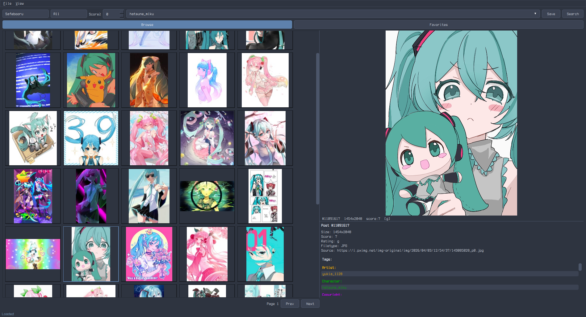</picture> <picture>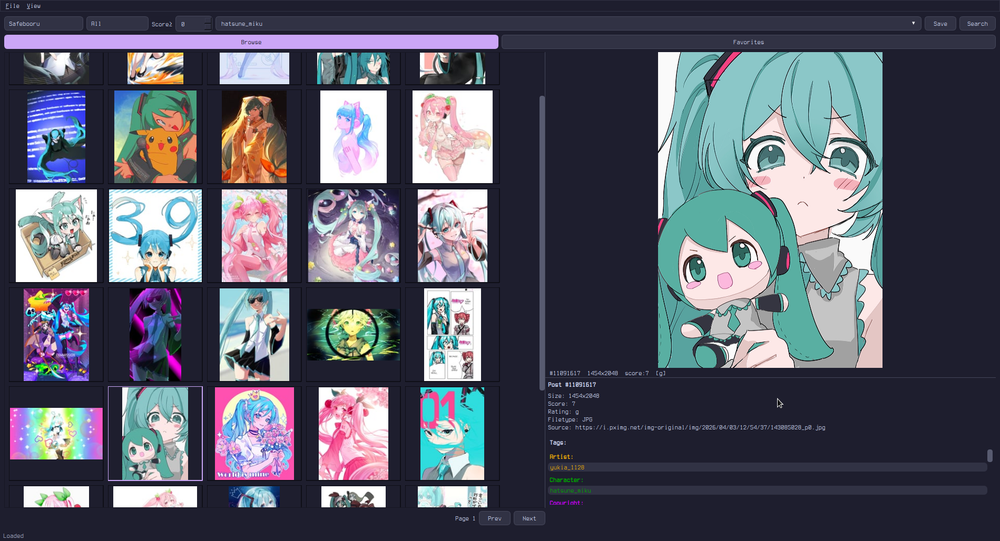</picture>

<picture>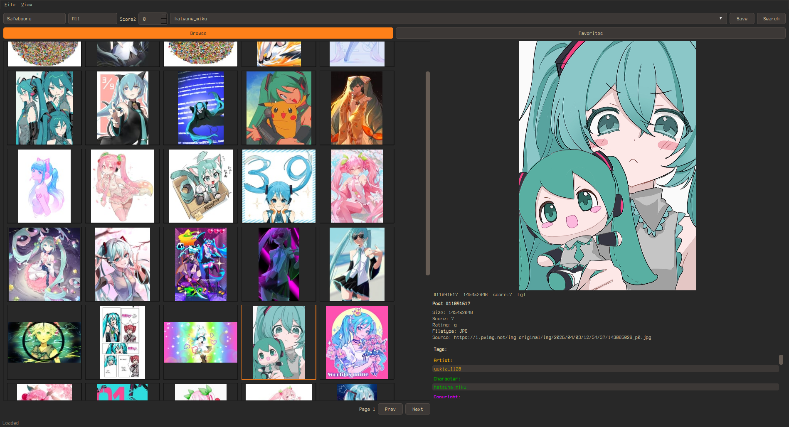</picture> <picture>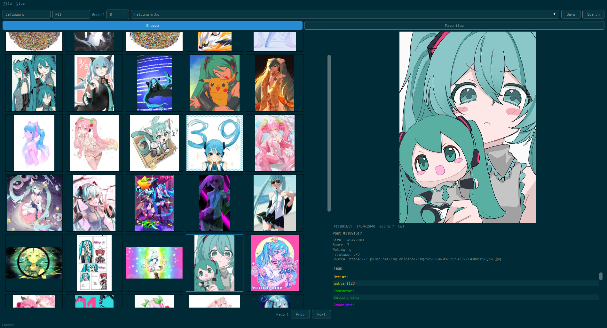</picture>

<picture>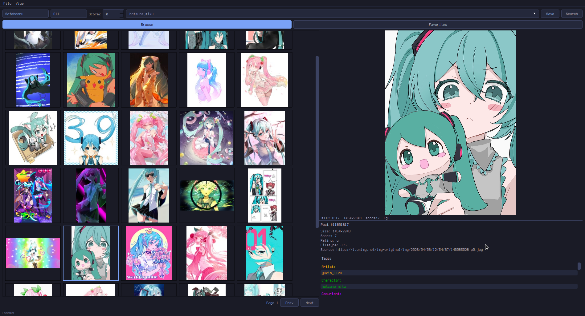</picture> <picture>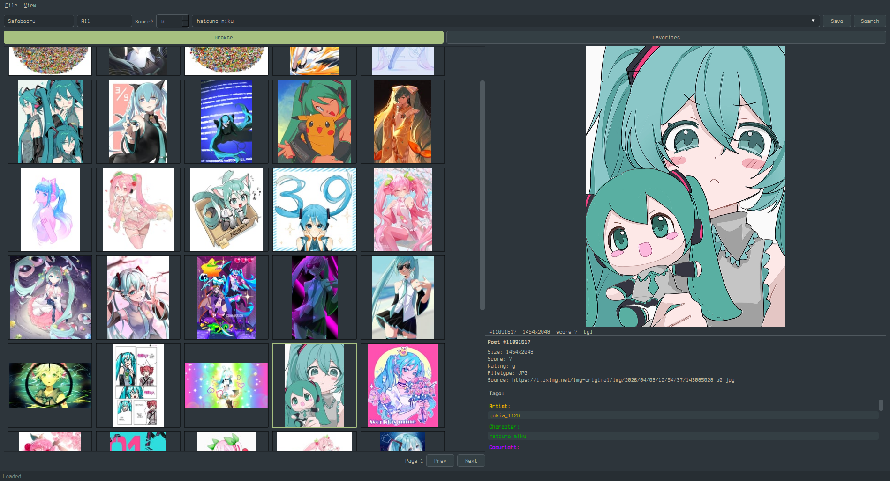</picture>

## Settings

- **General** — page size, thumbnail size, default rating/score, file dialog platform
- **Cache** — max cache size, auto-evict, clear cache on exit (session-only mode)
- **Blacklist** — tag blacklist with import/export
- **Paths** — data directory, cache, database locations
- **Theme** — custom.qss editor, template generator, CSS guide

## Data Locations

| | Linux | Windows |
|--|-------|---------|
| Database | `~/.local/share/booru-viewer/booru.db` | `%APPDATA%\booru-viewer\booru.db` |
| Cache | `~/.local/share/booru-viewer/cache/` | `%APPDATA%\booru-viewer\cache\` |
| Library | `~/.local/share/booru-viewer/saved/` | `%APPDATA%\booru-viewer\saved\` |
| Theme | `~/.local/share/booru-viewer/custom.qss` | `%APPDATA%\booru-viewer\custom.qss` |

## Privacy

booru-viewer makes **no connections** except to the booru sites you configure. There is no telemetry, analytics, update checking, or phoning home. All data stays local on your machine.

Every outgoing request is logged in the debug panel (View > Log) so you can verify this yourself — you will only see requests to the booru API endpoints and CDNs you chose to connect to.

## License

MIT
